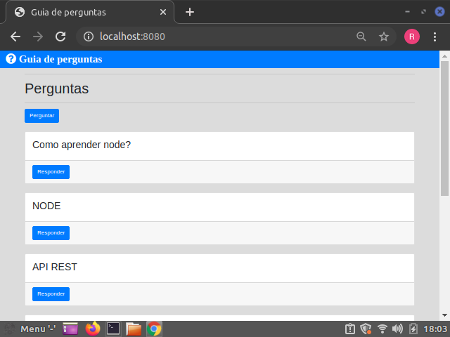
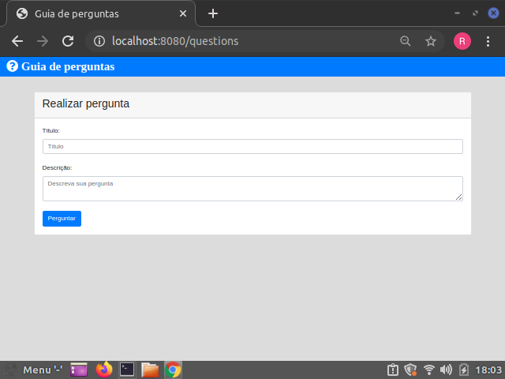
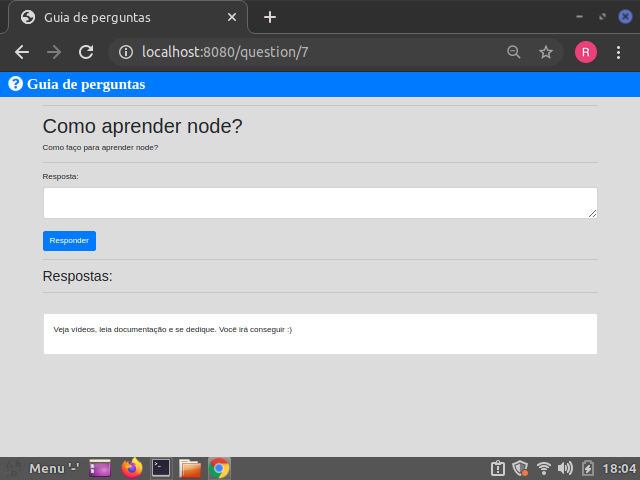

# Sobre o sistema 

Será criado um sistema de perguntas e respostas, no qual o usuário consegue interagir fazendo perguntas com outros usuários que responderam suas dúvidas.

# Imagens do Projeto:

 

 




# Objetivo: 

O objetivo é ensinar a parte lógica desse programa, para isso, irei explicar passo a passo de como foi feito, porém focado no backend com o node.js, que é um interpretador JavaScript que roda fora do browser(navegador).

# Ferramentas utilizadas: 

As ferramentas utilizadas foram os frameworks: Express, tamplating engine: EJS, sequelize para criar as tabelas do banco de dados, mysql2 que é o banco que utilizaremos e o body-parser que é um módulo capaz de converter o body da requisição para vários formatos

Para quem está em dúvida do que é um templating engine, o mesmo é uma linguagem de modelagem simples que permite gerar marcação HTML com JavaScript. Sem religiosidade sobre como organizar as coisas. Sem reinvenção de iteração e fluxo de controle. É simplesmente JavaScript. 

Para continuar o projeto instale:
```
npm install express --save ou yarn add express --save

npm install ejs --save ou yarn add ejs --save

npm install body-parser --save ou yarn add body-parser --save

npm install sequelize  --save ou yarn add sequelize  --save

npm install mysql2 --save ou yarn add mysql2  --save

```
# Iniciando o arquivo principal: 

**Vamos a prática!**

Em primeiro momento, precisamos configurar a porta em que nosso servidor vai rodar e as rotas. Para isso vamos começar importando o express, o qual é um super framework que serve para gerenciar requisições http, integrar "view engines" para inserir dados nos templates(exemplo: ejs), definir as configurações comuns da aplicação web, como a porta a ser usada para conexão e a localização dos modelos que são usados para renderizar a resposta e adicionar novos processos de requisição por meio de "middleware" em qualquer ponto da "fila" de requisições.

```
const express = require('express');
const app = express();

app.get("/", (req, res) => {
	res.send("Hello world");
});

app.listen(8080); 

```

**Com essas linhas de códigos já temos um servidor criado e rodando na porta 8080 do browser. Ao mesmo tempo, já temos uma rota get criada, que mostra "Hello world", apenas para vermos se está tudo funcionado. E sim, está tudo ok.**

```
http://localhost:8080/ 
```

**É só acessar a url do localhost na porta 8080 e vemos como está tudo ok.**


# Usando ejs no aplicação:

Como já dito anteriomente, utilizarei o ejs para renderizar na tela conteúdo html. Para isso preciso acrescentar no código acima, a set view engine indicando que usarei o ejs.

```

const express = require('express');
const app = express();

```
Setando a view engine que é apenas uma indicação de que irei utilizar um template engine para renderizar html na tela.
```
app.set('view engine', 'ejs');

```
 **Veja que aqui houve uma modificação, pois ao invés de res.send = que envia uma resposta ao usuário, utilizei o res.render, simplismente pelo fato de dizer ao interpretador de códigos que quero renderizar html.**

**Veja também que apareceu um ("Home/index"); Isso porque, aqui não da para ver, mas nas pastas é perceptível que tem uma pasta nomeada como "views", essa pasta views não precisa ser mencionada no caminho, por exemplo: ("./views/Home/index"), pois com ejs essa pasta já é esperada para que ele interprete html com os documentos que há dentro dela, no nosso é o index que está dentro da pasta Home.** 
```
app.get("/", (req, res) => {
	res.render("Home/index");
});

app.listen(8080);

```

# Pasta views 

Anteriomente, foi citado a pasta views, ela é a responsável por guardar nossos documentos html. Entretanto, há uma diferença na nomeclatura da extensão do documento. Sabemos, que um documento html possui a extensão .html, porém como estamos usando ejs será utilizado .ejs. Nada muda no conteúdo, apenas a extesão.

Com isso feito, podemos partir para a criação do sistema de perguntas e respostas.

Vale ressaltar, que quando formos injetar JavaScript no mesmo arquivo html utilizamos o fechamento: <% %>
**Não irei se prolongar na estrutura html, para que a explicação do node.js fique mais completa.**


# Server

Voltando a explicacar a estrutura do nosso index.js principal(o que está rodando o servidor), acrescentaremos mais uma linha de código:
```
app.use(express.static('public'));

```
Esse express.static é um metódo que permite trabalhar com arquivos que não vão mudar, ele foi chamado para que a estrutura do html junto ao css ficasse completa em quisitos de estilização. O 'public' faz referência a pasta pulic que contém o bootstrap.

Dessa forma, na pasta views criaremos mais um documento ejs para ficar responsável pelo formulário de perguntas. E para funcionar criamos uma pasta de rota nomeada como **routes** que possui dentro os arquivos **home.js/questions.js/questionsID/response.js**. E para essas rotas funcionarem é preciso chamá-las no arquivo princial instânciando-as em uma variável e usando-as logo depois:

```
const routerHome = require('./routes/home');
const routerQuestions = require('./routes/questions');
const routerSaveQuestions = require('./routes/saveQuestions');
const routerQuestionsID = require('./routes/questionsID');
const routerResponse = require('./routes/response');

```
```
app.use("/", routerHome);
app.use("/", routerQuestions);
app.use("/", routerSaveQuestions);
app.use("/", routerQuestionsID);
app.use("/", routerResponse);

```
Também foi adicionado outras dependências: body-parser que será como um decodificador de formatos. Ele vai servir para trabalhar com o formato json.

```
const bodyParser = require('body-parser');
app.use(bodyParser.urlencoded({ extended: false }));
app.use(bodyParser.json());

```
Para finalizar o arquivo principal, a conexão do banco de dados é feita. O arquivo que faz a conexão do banco de dados está na pasta **database** nomeado como **database.js**

```
const connection = require('./database/database');

```
**Lembrando que para se certificar que a conexão foi feita e ocorreu sem nenhum erro é preciso tratar isso com uma promise e por isso é recomendável que teste com o seguinte comando:**

```
connection
	.authenticate().then(()=> {
		console.log("Connected");
	}).catch((error)=> {
		console.log(error);
	})

```
**O .authenticate() é um metódo que recebe uma promise para testar se ouve a conexão com o banco de dados**


# Banco de dados e models: 

Na pasta database tem um arquivo nomeado como **database.js**. Esse será responsável por fazer a conexão com o banco de dados.

**Ele possui a seguinte estrutura:**
 ```
const Sequelize = require('sequelize');

const connection = new Sequelize('Nome_do_DB', 'nome do usuário do baco de dados', 'password do banco de dados', {
	host: 'localhost',
	dialect: 'mysql'
});

module.exports = connection;

 ```
Primeiro instânciamos o Sequelize que é o responsável por converter códigos JavaScript em códigos mysql. Em seguida guardamos as informações do banco de dados em uma constante que recebe um novo Sequelize com os dados do banco, tais como: nome do banco, nome do usuário no mysql(Muitas vezes root) e a senha do mesmo.
**O host é apenas para indicar em qual local esse banco está rodando. Como é na sua máquina será Localhost.**
**O dialect será para indicar qual banco de dados você irá utilizar. Poderia ser MongoDB, PostGreSQL, SQLITE, entre outros.**

# Explicações dos models:

Dentro da pasta database, criei a pasta models para armazenar os arquivos de models, os quais ficam responsáveis pela criação de tabelas do banco de dados. 


# Linhas de códigos dos models:

Em primeiro momento, é preciso instânciar o Sequelize e guardá-lo em uma variável. 

```
const Sequelize = require('sequelize');

```
Logo depois, é necessário importar a conexão com o banco de dados que está um arquivo atrás de nossa pasta atual. (Dentro da pasta database - na qual estamos - nomeado de database.js).

```
const connection = require('../database');


```
Feito isso, podemos começar a criar a primeira tabela de perguntas. A escolha foi de guardar essa tabela em uma constante, para que, futuramente, o seu conteúdo não seja subscrito.

Pelo comando:
```
connection.define('Nome da tabela', {
	nome das colunas: {
		type: SEQUELIZE.STRING/INTEGER/ETC,
		allowNUll: false
		} 
});
```
falamos através de códigos ao interpretador JS, que queremos definir uma tabela com um determinado nome e que essa tabela terá determinadas colunas.
Lembrando que esse connection é apenas a variável que recebe a importação do arquivo da conexão com o banco de dados.

O nome da tabela será Questions e recebe as colunas: title e description. Ambas possuem um tipo, na primeira foi definido Sequelize.STRING e na segunda Sequelize.TEXT, a diferença entre as duas é que a STRING é indicada como um texto com poucos caracteres, ou seja, um texto curto e o TEXT é um estrutura mais grande e com mais caracteres. Como foi trabalhado com o ORM Sequelize então sempre que for para definir o tipo é preciso mencioná-lo antes da definição do tipo. Em seguida, definimos o allowNull como false, isso apenas indica que o campo não pode ser nulo, ou seja, é obrigatório.

Para finalizar é necessário tratar com uma promisse a criação dessa tabela, para que seja evitado futuros erros. Ademais, é mencionado que não utilizaremos force, pois caso a tabela já tiver criada não é necessário criá-la de novo.

```

Questions.sync({ force: false }).then(()=> {});
```
 **Observação**

Todos os comandos acima também se aplica para o segundo model criado. A única diferença é o nome da tabela e das colunas, além do mais há uma coluna a mais que faz um relacionamento com o id da tabela citada acima.

# Começando com as rotas 

**As rotas serão separadas do index.js(file principal que roda o servidor) por questões de organização e de fácil manutenção futuramente.** <br />
**Lembrando que é preciso importá-las no index.js(arquivo que roda o servidor), Isso é explicado no primeiro tópico.** <br />

É de conhecimento geral que precisamos de rotas para chegarmos em diferentes lugares. E em um sistema de computador não é diferente, o express irá ajudar na criação dessas rotas.

Utilizaremos o express.Route(); para conseguirmos realizar essas rotas.

# Estrutura das rotas: 

**Como dito anteriomente, utilizaremos o express para gerenciar as rotas.** 

```
const express = require('express');
const router = express.Router();

```

Em todos os arquivos precisamos utilizar essa estrutura de importação, pois é obrigatório para as rotas funcionar.

Com a instância de manuseio de rotas na variável router, podemos iniciar qualquer rota. (GET, POST, PUT, DELETE).

As rotas desse backend será divididas em GET E POST, em sua maioria GET, pois é a de buscar informações. Apenas em duas utilizaremos POST, a qual é para criar uma pergunta e a outra cria uma resposta. 

Sabendo disso, começaremos com a home.
Como é peceptível nas pastas Views/Home a home é apenas uma amostra visual das perguntas e com um button que leva a outra página de fazer pergunta ou responder a uma.

Para iniciar qualquer rota é preciso seguir a seguinte estrutura:

```
router.get, post, delete, put("/", (req, res)=> {
	
});

module.exports = router;

```

Essa estrutua é a base, pois router é a instância do express.router(); que vai gerenciar essa rota que está sendo criada. 
O método é o segundo a ser expresso e pode-se usar get, post, delete, etc... Depende de qual tipo de rota você deseja. Nesse caso, a home vai mostrar as perguntas feitas então ficará com o get.
A barra ("/") indica o caminho que essa rota vai percorrer. Ela pode vim seguida de um nome que você desejar para nomear a rota, porém como é a página home deixamos só a barra para indicar que está na raiz do sistema, ou seja, na home.
Essa rota recebe uma função(nesse caso uma Arrow Function) com os parâmetros req, res que serão responsáveis pela realizar a comunicação recebendo suas REQUISIÇÕES e devolvendo RESPONSE(Respostas). <br />

Nesse arquivo há mais uma importação, a qual tem o objetivo de chamar outro arquivo que é o de model, o possui as tabelas do banco de dados. <br />

**Esse model é o da tabela de perguntas** <br /> 

```
const Questions = require('../database/models/questions');

```
Como na rota home teremos apenas uma busca pelos itens da tabela usaremos alguns metódos que nos ajudará a procurar todos esses itens e depois guardá-los variáveis.

```
router.get("/", (req, res)=> {
	Questions.findAll({ raw: true, order: [
		[ 'id', 'DESC' ]
		] }).then(questions => {
		res.render("Home/index", {
			questions: questions
		});

	});
});

module.exports = router;

```

**Essa é a estrutura do arquivo home.**

Para entender o que está acontecendo é necessário imaginar que esse código está encapsulando os códigos mysql. <br />

Quando utilizamos o Questions.findAll(); é o mesmo que utilizar o seguinte comando:
```
SELECT * FROM Questions;
```
**Esse questions é a instância do arquivo model de perguntas. Lembre-se que nele temos a tabela Questions e que lá temos todo o conteúdo das perguntas nas colunas title e description.**

 Esse metódo recebe a seguinte propriedade:
```
 ({ raw: true, order: [
		[ 'id', 'DESC' ]
		] })
```

- Raw:true = para vim apenas as informações do title e da description sem a data e outros conteúdo que não desejamos.
- Order = Ordenar do jeito que você quer, nesse sistema queremos que a última pergunta feita seja a primeira a aparecer. Então para fazer isso podemos usar o id em ordem decrescente, pois o último id possui a última pergunta feita.
<br />

Depois desses passos precisamos capturar o resultado vindo dessas linhas de códigos. Para isso usamos uma promisse:
```
.then(questions => {
		res.render("Home/index", {
			questions: questions
		});
```
**Essa variável questions irá capturar os resultados e guardá-los dentro dela, então criamos outra variável e passamos esse valor para ela. Depois só renderizamos esse valor na tela home. Lógico que para isso você precisa percorrer essa variável com um forEach na pasta views/Home/index.js**

# Rota de perguntas: 

Essa é a rota mais simples que tem, ela serve apenas para navegarmos na página de perguntas. A estrutura é a seguinte:

```
router.get("/questions", (req, res) => {
	res.render("Questions/index");
});

module.exports = router; 
```

**Ela só renderiza na tela o arquivo index da pasta Questions, a qual têm os formulários de peguntas, porém ela não guarda nada ainda. É só uma navegação para mostar a parte visual.**

#Rota de Perguntas pelo id:

**De primeira já é preciso importar os models de perguntas e respostas.**

```
const Questions = require('../database/models/questions');
const Response = require('../database/models/response');
```

Essa rota tem uma lógica diferente, pois ela se preocupa em mostrar as perguntas pelo o id. 

**Ela é uma rota de busca(GET) e irá renderizar seu conteúdo no endpoint (/question/:id).** 

Tem a seguinte estrutura: 

```
router.get("/question/:id", (req, res) => {
	var id = req.params.id;
	Questions.findOne({
		where : { id: id }
	}).then((question)=> {
		if (question != undefined) {
			Response.findAll({
				where: { questionId: question.id }, 
				order: [ [ 'id', 'DESC' ] ]
			}).then(responses => {
				res.render("Questions/questionId", {
				 questionId: question,
				 responses: responses
				});
			})

		}else {
			res.redirect("/");
		}
	});
});

module.exports = router;
```
### A variável id recebe a requisição dos params que o usuário digita na url - neste caso o do id - e com isso guarda o resultado. 
<br />

### O segundo comando depois desse é semelhante ao visto na rota home, porém muda na seleção, pois o mesmo procura por um único valor.
```
Questions.findOne({
		where : { id: id }
})

```

Esse comando acima é o mesmo que:

```
SELECT * FROM Questions where id=3;
```

**Lembrando que esse id=3 é apenas um teste para demonstrar como seria feito.**

Como já foi visto na rota home, esse comando recebe uma promisse que tem uma variável, a qual armazena os dados vindo do banco de dados.

Por isso é usado: 


```
then((question)=> {
	if (question != undefined) {
		Response.findAll({
			where: { questionId: question.id }, 
			order: [ [ 'id', 'DESC' ] ]
})

```
**Irei explicar só a lógica da condição, pois o resto já havia explicado e você pode conferir no tópico da rota home.**

O if foi usado para verificar se o paramêntro que o usuário digita no endpoint é um que realmente existe no banco de dados. Se ele for diferente de undefined, ele retornará uma outra busca no banco de dados porém refente a tabela Reponses. O resto do código indica que ele está selecionando tudo dessa tabela quando o campo questionId da tabela Responses é igual ao question.id da tabela Questions e o mostra em ordem decrescente.

Logo após isso há uma nova resposta guardada em outra variável:
```
.then(responses => {
			res.render("Questions/questionId", {
			 questionId: question,
				responses: responses
			});
})
```
Esse é a resposta da busca anteriomente feita e se houver, realmente, uma resposta ele irá renderizar na tela.

Caso for undefined temos o else para tratar isso:

```
}else {
	res.redirect("/");
}

```

**Se essa ação ocorrer redireciona a página home.**

# Rota de resposta:

A rota response ficou responsável por criar uma resposta. Diferente das que estamos acontumados até o momento essa será uma rota POST.

Estrutura da rota: 

**Instâncie o model response, pois utilizaremos essa tabela para criar uma resposta.** 

```
const tableResponse = require('../database/models/response');

```

**Nessa rota precisamos pegar o que o usuário digita no formulário, então é preciso informar a tag form que esses dados estão sendo capturados por essa rota /response.**

Com isso feito faça essa estrutua: 


```
router.post("/response", (req, res) => {
	var bodyofresponse = req.body.response;
	var id = req.body.responseId;

	tableResponse.create({
		body: bodyofresponse,
		questionId: id
	}).then(() => {
		res.redirect("/question/" + id);
	});
});

module.exports = router;

```

Essa rota é nova para a gente e por isso irei explicá-la detalhadamente.

**Antes de tudo, saiba que essas requisições feitas pelo req.body de algum formulário, só é possível graças ao body-parser.**

### A var bodyofresponse recebe a requisição do corpo do name="response" (propriedade do input). 
<br />


### A var id recebe a requisição do corpo do name="responseId" (propriedade do input).

**Esses names foram declarados na pasta views/Questions/questionsId.ejs.**

Com isso feito podemos inserir esses dados na tabela.

```
tableResponse.create({
		body: bodyofresponse,
		questionId: id
	}).then(() => {
		res.redirect("/question/" + id);
	});
```
Esse código é equivalente a:

```
INSERT INTO Responses(body, questionId) VALUES ('Corpo da resposta', '3');

```
Estamos apenas pegando o valor que o usuário digitou e repassando para a campo boy e questionId da tabela Responses. Com isso feito direcionamos o usuário a página da resposta feito juntamente com a sua resposta exposta lá.
<br />
**Observe que o endpoit muda:**
```
res.redirect("/question/" + id);

```

Isso faz com que na url apareça o id da resposta relacionada a pergunta.


# Rota de salvar as pergutas:

Está é semelhante a anteriomente feita. Ela usa o metódo post e também salvar algo numa tabela do banco de dados. Só que nessa será usada apenas a tabela Questions.

Primeiro importe uma instância da tabela armazenada em uma variável para usar os campos que há nela:
```
const Questions = require('../database/models/questions');

```
**Lembrando o express.Router(); precisa ser usada sempre, pois é o que faz as rotas funcionarem, não estou colocando essa parte, pois estou assumindo que você já sabe que isso é obrigatório.** 

### Estrutura da rota:

```
router.post("/savequestions", (req, res) => {
	var title = req.body.title;
	var description = req.body.Description;

	Questions.create({
		title: title,
		description: description
	}).then(()=> {
		res.redirect("/");
	})
});

module.exports = router;

```

**Como é bastante semelhante a rota de respostas, alguns conceitos não irei falar tão detalhadamente, pois já foi dito no tópico acima.**

Essa rota irá salvar as perguntas feitas pelos usuários. Nela é declarado duas variáveis que recebem o valor que o usuário digitou no formulário. 

**Só para ressaltar o req.body pega o valor através do name que é declarado no input.**

Para ficar mais claro irei colocar um trecho do código html aqui.

```
<input type="text" placeholder="Título" name="title" class="form-control">

```
Pegando esses dados, ele é repassado para a tabela Questions. Os campos da tabela recebem os valores que estão dentro das duas variáveis que recebem o req.body.title e req.body.description.

Com tudo isso feito tratamos isso com uma promisse que ao finalizar ocorrendo tudo certo redireciona o Usuário a página home e ali mostra sua pergunta feita.
